# Bem vindo ao Ebytr Project

Este projeto tem como finalidade **auxiliar** as pessoas colaboradoras a se organizarem e terem mais **produtividade**.

# Stacks

<details>
<summary><strong>🛠 Stacks</strong></summary>

O **Ebytr Project** é composto pelas seguintes stacks:
Front-End:

> `React.JS`

Back-End:

> `Node.Js` feito em TypeScript, utilizando a arquitetura MSC, metodologia POO e SOLID.

DB:

> `MySQL`

</details>

## Como utilizar?

<details>

O Projeto é **100%** Dockerizado, possui mais de **30%** de cobertura de testes e foi montado em uma forma da qual seja simples o seu uso.
Backend possui **75%** de cobertura.

Simplesmente utilize o comando na pasta `./Ebytr-Project` :

```sh
npm run project
```

## Como logar no site:
Entre neste link:
https//localhost:3000/

insira a conta de visitante:
user: guest
password: secret_guest

</details>

## Diagrama de funcionamento da aplicação.

Um diagrama para melhor entendimento do funcionamento da _aplicação_:

## Login:

```mermaid
sequenceDiagram
Frontend ->> Backend: Login(POST)
Note right of Backend: Uma validação é feita<br> sobre os campos antes <br> da requisição para o DB.
Backend-->>DB: Este usuario existe?(SELECT)
DB-->> Backend: Usuario Existe(Response)
Backend->> Frontend: Token+Acesso (200-StatusCode)
Frontend ->> Backend: Me envie a lista de tarefas atualizada(GET)
Backend-->>DB: Todas as tarefas(SELECT)
DB-->> Backend: Lista de tarefas(Response)
Backend->> Frontend: Lista de tarefas (200-StatusCode)
```



## **Criação de Tarefas**:


